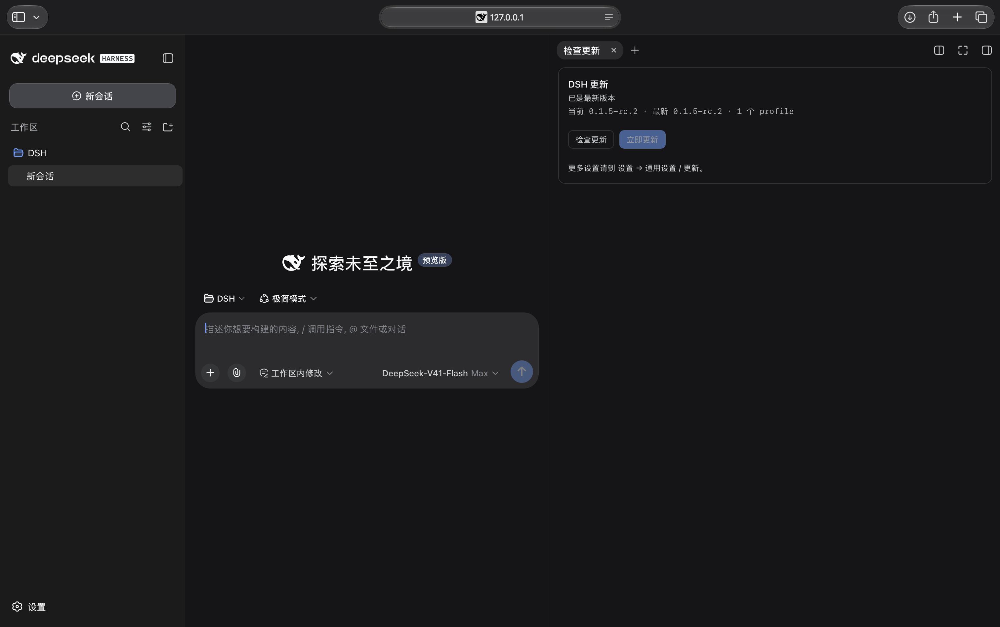
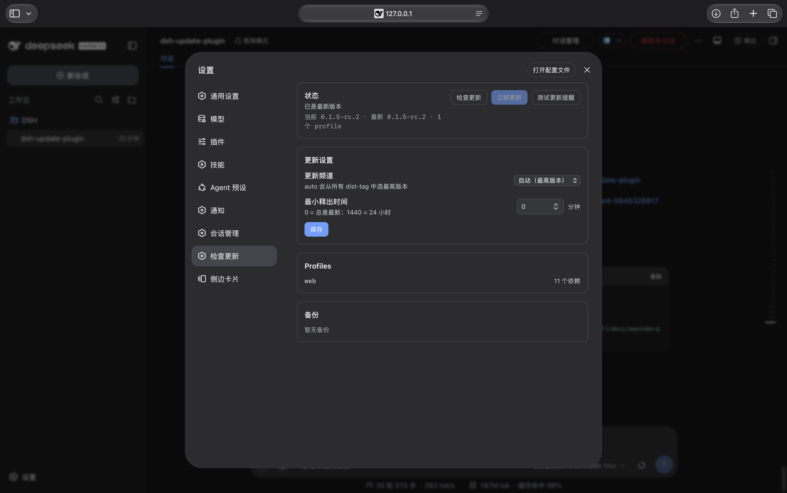

# dsh-update-plugin

[](https://github.com/haotian-lu-prog/dsh-update-plugin/actions/workflows/ci.yml)
[](https://www.npmjs.com/package/dsh-update-plugin)
[](https://github.com/topics/dsh-plugin)
[](LICENSE)

一条命令更新 **DeepSeek Harness (DSH)**、随包的 `@deepseek-ai/dsh-*` 以及
**所有 profile 插件**。

[English](README.md) · [更新日志](CHANGELOG.md) · [贡献指南](CONTRIBUTING.md)

> **已从 `dsh-update-all` 改名。** 现在仓库、CLI 命令、Homebrew formula 和 npm
> 包统一使用 `dsh-update-plugin`。如果你在 v0.2.0 之前装过 CLI，需要重装一次才能
> 拿到改名后的命令；旧的仓库 URL 会被 GitHub 自动重定向。

本仓库用同一个名字提供两个东西：

| 产物 | 安装方式 | 作用 |
| --- | --- | --- |
| **CLI**（`dsh-update-plugin`） | `brew install dsh-update-plugin` 或 `install.sh` | 一条命令更新 DSH CLI、随包依赖和所有 profile 插件 |
| **DSH Web 插件**（npm `dsh-update-plugin`） | `dsh plugin --profile web add dsh-update-plugin` | 在设置页和右侧栏加入「检查更新」 |

---

## 为什么需要它

DSH 的更新通常分散在至少两个地方：

1. 全局 CLI 包 `@deepseek-ai/dsh`——它同时携带所有
   `@deepseek-ai/dsh-*` bundle；
2. `~/.dsh/profiles/<name>` 下的每个 profile——社区插件本质上是每个
   profile 的普通 `pnpm` 依赖。

手动更新意味着要记住 `npm install -g @deepseek-ai/dsh@next`，然后
`dsh plugin --profile web update`，还要对每个 profile 重复一遍。本工具会
全部处理：自动发现新 profile、新插件，并且知道 npm 的 `latest` dist-tag
对 DSH 来说并不一定是最新版本。

## 特性

- **一条命令**：`dsh-update-plugin`。
- **CLI + 插件**：同时更新全局 CLI 和所有 profile 的插件。
- **真正最新**：比较 npm 的**所有** dist-tag（`latest`、`next`、`alpha`…），
  不盲信 `latest`。
- **面向未来**：从 `$DSH_HOME/profiles/*/package.json` 动态发现 profile，
  以后新增 profile/插件无需改脚本。
- **识别安装方式**：根据 `dsh` 的真实安装位置选择 `npm` 或 `pnpm`。
- **默认安全**：每次实际更新前自动备份，支持 `--rollback` 一键回滚。
- **预览模式**：`--dry-run` 只显示将要执行的操作。
- **可控通道**：`--channel stable|next|alpha|auto`，以及用于 pnpm
  `minimumReleaseAge` 的 `--min-age <分钟>`。
- **体积小**：单个 Bash 脚本，兼容 macOS 自带的 Bash 3.2。

## DSH Web 插件

`dsh-update-plugin` 会在 DSH Web 的 **设置 → 通用设置** 里加入一行
「检查更新」，和权限、语言、外观、字号大小同级。它还提供完整的
**设置 → 检查更新** 页面（频道、`--min-age`、profiles、备份、回滚）以及带更新
角标的**右侧边栏原生 tab**。更新逻辑内置，不依赖 Homebrew，也不需要单独安装
shell 脚本。





```bash
# 从 npm 安装
dsh plugin --profile web add dsh-update-plugin

# 本地开发 / 从本仓库安装
dsh plugin --profile web add /path/to/dsh-update-plugin/plugin
```

安装、兼容性、兜底方案和开发说明见 [`plugin/`](plugin/)；社区公告文案见
[`docs/announcement.md`](docs/announcement.md)。如果 pnpm 的
`minimumReleaseAge` 策略阻止安装，在 `dsh plugin add` 命令后加
`--config.minimum-release-age=0` 即可。请务必用 `dsh plugin add` 挂载，
不要只用 `pnpm add`，否则不会写入 `dsh.profile.bundles`。

## 环境要求

- macOS 或 Linux（WSL 可用）
- `bash` 3.2 及以上
- `node`（DSH 本身就需要 Node.js）
- `npm`（查询 registry；当 DSH 由 npm 安装时也用于更新 DSH）
- `pnpm` 通过 `dsh plugin` 调用，DSH 安装中已有
- 已安装 DSH——没有也可以用它来引导安装

## 安装

### 一行安装

```bash
curl -fsSL https://github.com/haotian-lu-prog/dsh-update-plugin/releases/latest/download/install.sh | bash
```

安装器会从 `refs/heads/main` 拉取最新版 updater。若想直接用 main 分支上的安装器：

```bash
curl -fsSL https://raw.githubusercontent.com/haotian-lu-prog/dsh-update-plugin/refs/heads/main/install.sh | bash
```

### Homebrew

```bash
brew tap haotian-lu-prog/dsh-update-plugin https://github.com/haotian-lu-prog/dsh-update-plugin
brew trust haotian-lu-prog/dsh-update-plugin
brew install dsh-update-plugin
```

Homebrew 6+ 默认不加载第三方 tap 的 formula，`brew trust` 是每个 tap 只需
执行一次的操作；较老版本没有 trust 命令的话跳过这行即可。

formula 就在本仓库里（`Formula/dsh-update-plugin.rb`），每次发版会自动更新
`url` 和 `sha256`，`brew upgrade dsh-update-plugin` 就能拿到最新版，不需要独立
的 tap 仓库。

### 手动安装

```bash
git clone https://github.com/haotian-lu-prog/dsh-update-plugin.git
cd dsh-update-plugin
./install.sh --local dsh-update-plugin.sh
```

### 本地直接运行（不安装）

```bash
bash ./dsh-update-plugin.sh --dry-run
```

如果 `~/.local/bin` 不在 `PATH` 中，安装脚本会提示需要添加的配置。

## 使用

```bash
# 更新所有东西到最新（默认）
dsh-update-plugin

# 只预览，不做修改
dsh-update-plugin --dry-run

# 只跟随 stable（latest）通道
dsh-update-plugin --channel stable

# 保守模式：只接受发布满 24 小时的版本
dsh-update-plugin --min-age 1440

# 只更新一个 profile
dsh-update-plugin --profile web

# 只更新 CLI / 只更新插件
dsh-update-plugin --no-plugins
dsh-update-plugin --no-cli

# 跳过确认（脚本 / cron）
dsh-update-plugin --yes

# 查看备份并回滚
dsh-update-plugin --list-backups
dsh-update-plugin --rollback
dsh-update-plugin --rollback 20260911T211500
```

更新完成后请重启正在运行的 `dsh web` / DSH 会话。

## 选项

| 选项 | 说明 |
| --- | --- |
| `--channel <auto\|stable\|next\|alpha>` | 跟随哪个 npm dist-tag。`auto`（默认）取所有 tag 中版本最高者；`stable` 即 `latest`。 |
| `--min-age <分钟>` | 只接受发布满 N 分钟的版本。`0`（默认）总是最新；`1440` = 24 小时。 |
| `--profile <name>` | 只更新指定 profile，可重复。 |
| `--no-cli` | 不更新全局 `dsh` CLI。 |
| `--no-plugins` | 不更新 profile 插件。 |
| `--no-backup` | 跳过自动备份。 |
| `-n`、`--dry-run`、`--check` | 只打印计划，不做任何修改。 |
| `-y`、`--yes` | 跳过确认。 |
| `--list-backups` | 列出可用备份。 |
| `--rollback [id]` | 回滚到指定备份（默认最新）。 |
| `--install` | 把本脚本安装到 `~/.local/bin`。 |
| `--target-version` | 只打印将要安装的最新版本后退出（适合脚本 / CI）。 |
| `-h`、`--help` | 查看帮助。 |
| `-V`、`--version` | 查看 updater 版本。 |

### 环境变量

| 变量 | 默认值 | 含义 |
| --- | --- | --- |
| `DSH_HOME` | `~/.dsh` | DSH home 目录。 |
| `DSH_UPDATE_CHANNEL` | `auto` | 同 `--channel`。 |
| `DSH_UPDATE_MIN_AGE` | `0` | 同 `--min-age`。 |
| `DSH_NPM_CACHE` | `~/.cache/dsh-update/npm` | 元数据与全局安装使用的 npm cache。 |
| `DSH_UPDATE_BACKUP_DIR` | `$DSH_HOME/update-backups` | 备份目录。 |
| `DSH_UPDATE_INSTALL_DIR` | `~/.local/bin` | `--install` / `install.sh` 的安装目录。 |
| `NO_COLOR` | 未设置 | 设置后关闭彩色输出。 |

## 工作原理

1. **解析目标版本**：向 npm 查询 `@deepseek-ai/dsh` 的 `dist-tags`，按
   semver 规则比较。默认 `--channel auto` 取最高版本，因此能拿到比
   `latest` 更新的 `next` 版本。
2. **识别安装方式**：解析 `dsh` 背后的真实路径，选择 `npm` 或 `pnpm` 全局安装。
3. **备份**：把每个选中 profile 的 `package.json` 与 `pnpm-lock.yaml`，以及
   当前 CLI 版本，复制到 `$DSH_HOME/update-backups/<时间戳>/` 并写入
   `manifest.json`。
4. **更新 CLI 与 bundle**：一次全局安装即可更新 `@deepseek-ai/dsh` 及其全部
   `@deepseek-ai/dsh-*` 依赖。
5. **更新 profile**：对每个有依赖的 profile 执行
   `dsh plugin --profile <name> update --latest`，必要时回退到 profile 目录里的
   `pnpm update --latest`。
6. **收尾**：打印新的 CLI 版本，并提醒重启 DSH。

## 安全与回滚

- 先预览：`dsh-update-plugin --dry-run`。
- 每次实际更新默认都会备份，位置在 `~/.dsh/update-backups/`。
- 一键回滚（恢复 profile 清单、lockfile、依赖以及旧版 CLI）：

  ```bash
  dsh-update-plugin --rollback
  ```

- 默认会给 pnpm 传 `--config.minimum-release-age=0`，即不等待 24 小时供应链延迟。
  如需更保守：`dsh-update-plugin --min-age 1440`（或
  `DSH_UPDATE_MIN_AGE=1440`）。
- 本工具只写入你的 DSH home 以及全局 npm/pnpm 前缀，不会向任何其他服务器
  发送数据；npm/pnpm 只会访问它们各自的 registry。

## 常见问题

**Homebrew 提示 tap 不受信任怎么办？**
Homebrew 6+ 默认不加载第三方 tap。执行一次
`brew trust haotian-lu-prog/dsh-update-plugin`（或
`brew trust --formula haotian-lu-prog/dsh-update-plugin/dsh-update-plugin`），
然后重新执行 `brew install dsh-update-plugin` 即可。

**为什么 `latest` 不是最新版？**
DSH 目前仍在发布预发布版，例如某段时间 `latest` 是 `0.1.5-rc.1`，而 `next`
已经是 `0.1.5-rc.2`。`--channel auto` 会比较所有 dist-tag，选取真正的最高版本。

**会把插件更新到发布不足 24 小时的新版本吗？**
默认 `--min-age 0` 会。需要延迟保护请加 `--min-age 1440`。

**我是用 pnpm 安装的 DSH，能用吗？**
可以。脚本会检测 `dsh` 可执行文件的真实路径，并用对应的包管理器更新。

**会更新 DSH Desktop 吗？**
不会。本项目更新 CLI 和 profile 插件；桌面端有自己的更新机制。

**Windows 能用吗？**
请在 WSL 或 Git Bash 中使用；原生 PowerShell 不支持。CI 覆盖 macOS 与 Linux。

**没有 profile 怎么办？**
没关系，插件步骤会自动跳过，CLI 及其 bundle 仍会更新。

## 发布与自动化

- 推送 `v0.1.1` 这样的 tag 会触发 **Release** workflow：校验 tag 与
  `UPDATER_VERSION` 是否一致，自动创建 GitHub Release、生成 release notes，
  并附带 `dsh-update-plugin.sh` 和 `install.sh`。
- `make release VERSION=0.1.1` 会一次性完成版本号更新、提交、打 tag、推送。
  需要先在 `CHANGELOG.md` 里写好对应版本条目。
- 同一个 Release workflow 还会更新本仓库里的
  `Formula/dsh-update-plugin.rb`，所以发布完成后 Homebrew 立刻指向新版本，
  不需要额外 secret，也不需要第二个仓库。
- **Upstream check** workflow 每天解析 `@deepseek-ai/dsh` 的最新版本，一旦发现
  比本仓库记录的版本更新，就自动开 issue 提醒维护者适配。

## 贡献

欢迎提 Issue 和 PR。本地开发与测试说明见 [CONTRIBUTING.md](CONTRIBUTING.md)。

## 许可证

[MIT](LICENSE)
