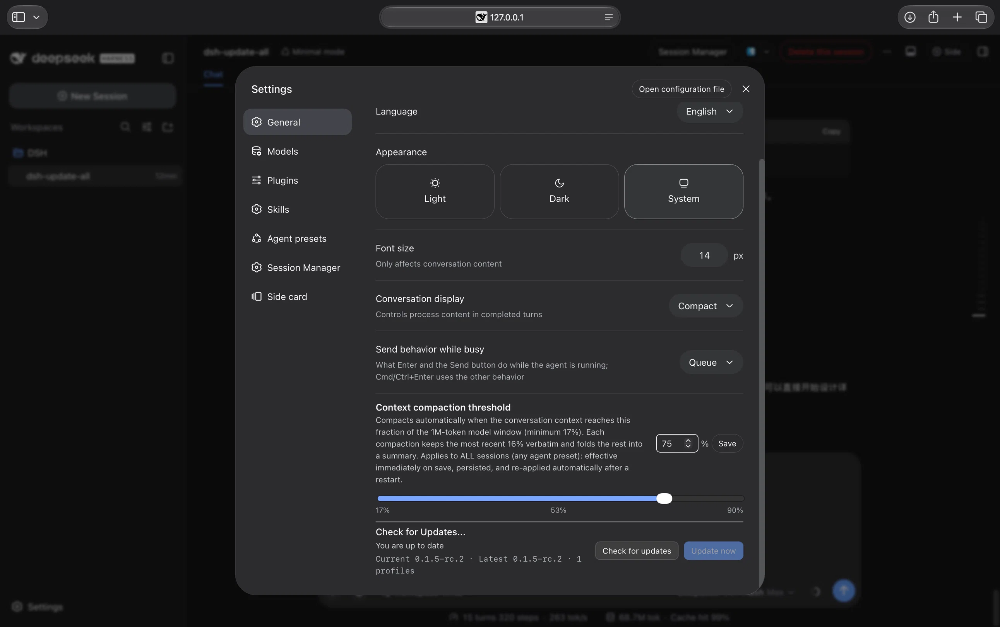
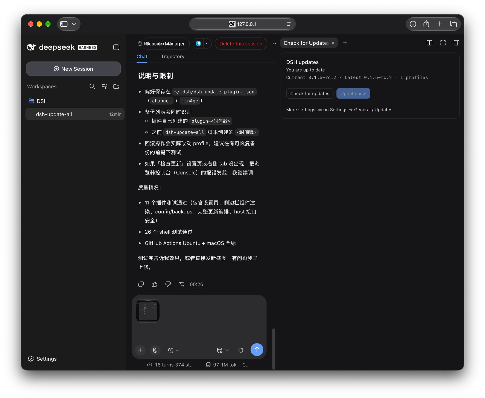

# dsh-update-plugin

English | [中文](README.zh-CN.md)

[](https://www.npmjs.com/package/dsh-update-plugin)

A DSH Web plugin that adds **Check for Updates...** (「检查更新」in Chinese) to
**Settings → General**, right next to Permission, Language, Appearance and Font
Size.

From one row you can check for a newer DeepSeek Harness release and update:

- the global `@deepseek-ai/dsh` CLI and every bundled `@deepseek-ai/dsh-*` package;
- every profile's plugins under `~/.dsh/profiles/*`.

The update logic is built into the plugin. It does **not** require Homebrew or a
separately installed `dsh-update-all` script.




## Install

```bash
# from npm
dsh plugin --profile web add dsh-update-plugin

# from a local checkout (development)
dsh plugin --profile web add /path/to/dsh-update-all/plugin
```

If pnpm refuses the install because its `minimumReleaseAge` policy rejects an
already-updated lockfile entry (for example right after you used
`dsh-update-all --min-age 0`), rerun the command with the policy relaxed for
that single install:

```bash
dsh plugin --profile web add /path/to/dsh-update-all/plugin --config.minimum-release-age=0
```

> **Always mount with `dsh plugin add`, not plain `pnpm add`.** The official
> command also appends the package to `dsh.profile.bundles`; a bare `pnpm add`
> only installs the dependency, so the Settings row never appears. If you
already used `pnpm add`, run the `dsh plugin ... add` command again — it is
idempotent and performs the bundle reconciliation.

Then restart DSH Web, open **Settings → General**, and look for the
**Check for Updates...** row.

## Usage

- **Settings → General** shows a quick **Check for Updates...** row.
- **Settings → Check for Updates...** (left navigation) is the full page: status,
  update channel, minimum release age, profiles, backups and rollback.
- A native **right-sidebar tab** shows a badge when an update is available; click
  it to check or update without leaving the conversation.
- The status card has a **Send test reminder** button: it opens the sidebar tab,
  sends a browser notification (permission required), and shows the update badge
  for 10 seconds so you can verify the reminder without a real release.
- The row shows the current and newest versions plus the number of profiles.
- **Check for updates** refreshes the status (it also refreshes after
  reconnecting).
- **Update now** updates the CLI and then every profile with dependencies.
  The host creates a backup under `~/.dsh/update-backups/` before changing
  anything.
- The full page lets you choose the update channel (`auto`, `stable`, `next`,
  `alpha`), set a `minimumReleaseAge` (minutes), list profiles, and roll back to
  any backup.
- After a successful update or rollback, restart DSH Web to load the new code.

The update only runs when the page is loopback and same-origin; a remote DSH Web
session can read the version but cannot start an update.

## Fallbacks

Two fallbacks are built in on purpose:

1. **The plugin can always be upgraded from the terminal**, even when the
   Settings row is broken or hidden:
   ```bash
   dsh plugin --profile web add dsh-update-plugin@latest
   ```
2. **A broken plugin never breaks DSH itself.** If the Settings slot or the
   browser bundle contract changes, the row disappears or shows an error; the
   rest of DSH keeps working. The manual commands shown in the row are always:
   ```bash
   dsh plugin --profile web update --latest
   dsh plugin --profile web add dsh-update-plugin@latest
   ```

## Troubleshooting

- **The Settings row/page is missing, or Save/backups return `HTTP 404`.**
  The browser half can hot-reload, but the host half (`lib/index.js`) is loaded
  when DSH starts. Fully restart DSH (stop and start `dsh web`, or restart DSH
  Desktop), then hard-refresh the browser.
- **The right-sidebar tab is not in the `+` menu.** It is registered through the
  native `sidebarRightTabs` API, which requires DSH 0.1.5-rc.1 or newer.
- **The install command is rejected by pnpm `minimumReleaseAge`.** Add
  `--config.minimum-release-age=0` to that single `dsh plugin add` command.

## Compatibility

| DSH version | Status |
| --- | --- |
| `0.1.0-rc.8` | expected to work |
| `0.1.1-rc.2` | expected to work |
| `0.1.2-rc.1` | expected to work |
| `0.1.5-rc.1` | expected to work |
| `0.1.5-rc.2` | tested |

DSH is pre-1.0, so a major release may rename a client slot or change a public
service. When that happens this plugin needs a small compatibility release; the
fallback commands above keep users unblocked meanwhile.

## How it works

- **Client half** (`lib/client.js`) registers into the public
  `settings.general.item` slot used by the native General rows, and talks to two
  loopback endpoints.
- **Host half** (`lib/index.js`, `lib/update-core.js`) resolves the newest
  version across all npm dist-tags (or a chosen channel), discovers profiles,
  backs them up, updates the CLI with npm or pnpm, and updates each profile
  through `dsh plugin --profile <name> update --latest` (with a `pnpm update`
  fallback).
- Host endpoints: `/status`, `/update`, `/config`, `/backups` and `/rollback`
  under `/api/dsh-update-plugin/`.
- Only Node built-ins are used, so there is no extra dependency to trust.

## Release

1. Bump `version` in `plugin/package.json` and add the release notes.
2. Commit, then tag and push:
   ```bash
   git tag plugin-vX.Y.Z
   git push origin plugin-vX.Y.Z
   ```
3. The **Publish plugin** workflow publishes the package to npm. It needs a
   repository secret named `NPM_TOKEN` with publish rights for
   `dsh-update-plugin`.

## Development

```bash
cd plugin
npm test                # node --test test/*.test.mjs
node --check lib/index.js
node --check lib/client.js
node --check lib/update-core.js
```

## License

[MIT](LICENSE)
