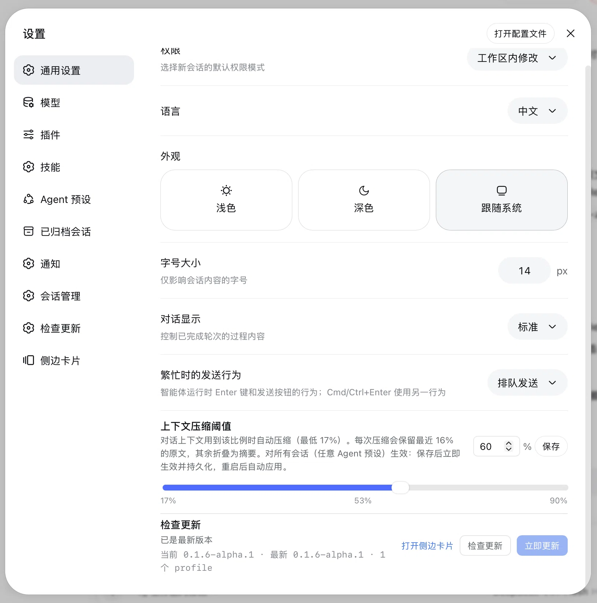
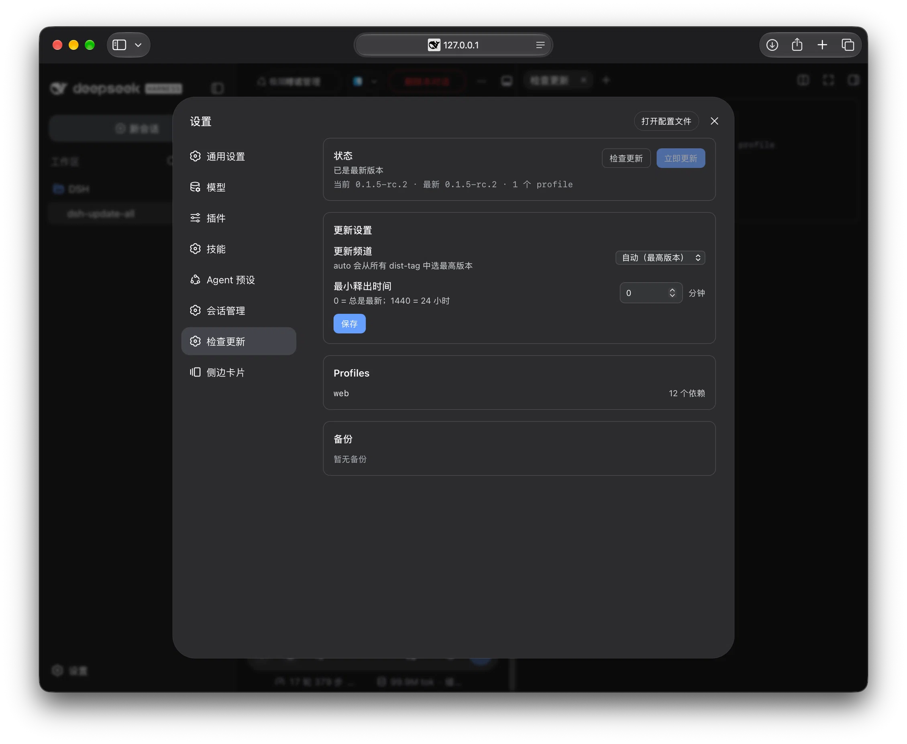
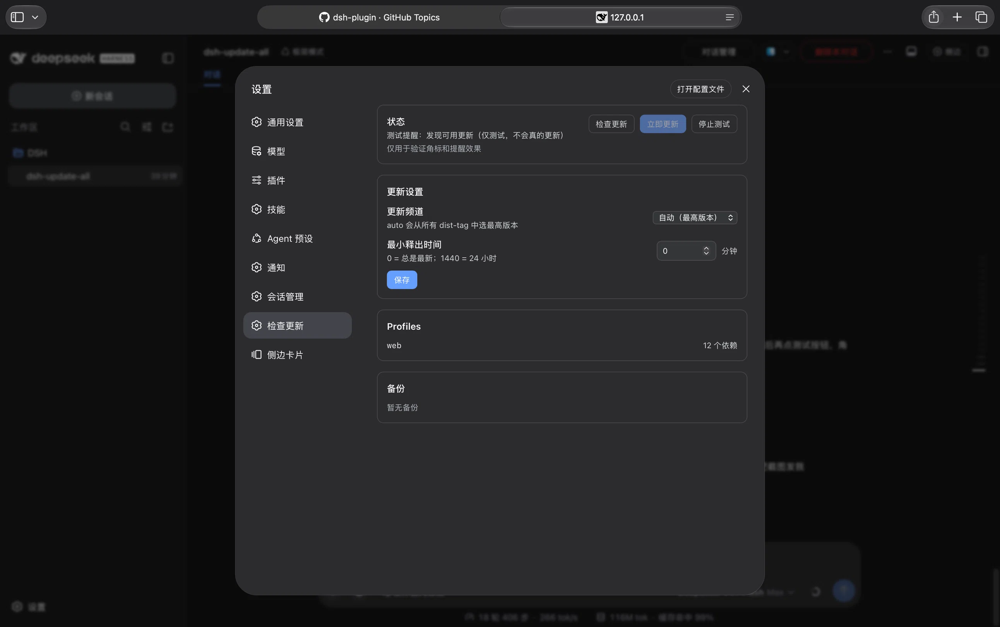

# dsh-update-plugin

[English](README.md) | 中文

[](https://www.npmjs.com/package/dsh-update-plugin)
[](https://github.com/topics/dsh-plugin)

一个 DSH Web 插件，在 **设置 → 通用设置** 里加入一行「检查更新」，和权限、语言、
外观、字号大小同级。

在这一行里可以检查并更新：

- 全局 `@deepseek-ai/dsh` CLI 以及随包的 `@deepseek-ai/dsh-*`；
- `~/.dsh/profiles/*` 下每个 profile 的插件。

更新逻辑完整内置在插件里，**不依赖 Homebrew，也不依赖单独安装的
`dsh-update-all` 脚本**。





## 安装

```bash
# 从 npm 安装
dsh plugin --profile web add dsh-update-plugin

# 本地开发 / 从本仓库安装
dsh plugin --profile web add /path/to/dsh-update-all/plugin
```

如果 pnpm 的 `minimumReleaseAge` 策略因为 lockfile 里已有较新的条目而拒绝安装
（例如刚用过 `dsh-update-all --min-age 0`），给这一次安装临时放开策略即可：

```bash
dsh plugin --profile web add /path/to/dsh-update-all/plugin --config.minimum-release-age=0
```

> **一定要用 `dsh plugin add` 挂载，不要只用 `pnpm add`。** 官方命令还会把包
> 追加到 `dsh.profile.bundles`；直接 `pnpm add` 只装依赖，不写 bundle 列表，
> 设置里就不会出现这一行。如果已经用 `pnpm add` 装过，再执行一次
> `dsh plugin ... add` 即可，它会完成挂载（幂等）。

然后重启 DSH Web，打开 **设置 → 通用设置**，就能看到「检查更新」这一行。

## 使用

- **设置 → 通用设置** 里有快捷的「检查更新」一行。
- **设置 → 检查更新**（左侧导航）是完整页面：状态、更新频道、最小释出时间、
  profiles、备份和回滚。
- **右侧边栏**有一个原生 tab，有更新时显示角标，点击即可检查或更新，不必离开
  当前会话。
- 状态卡片里有 **测试更新提醒** 按钮：会打开侧边栏 tab、发送浏览器通知
  （需要授权），并显示 10 秒的更新角标，方便验证提醒效果，不用等真实新版本。
- 行内显示当前版本、最新版本和 profile 数量。
- **自动检查**支持启动时 / 每小时 / 每天，也可以关闭；在设置页选择即可。
- 发现真实新版本且浏览器通知已授权时，每个新版本只通知一次。
- **检查更新**：刷新状态。
- **立即更新**：先更新 CLI，再更新每个有依赖的 profile；更新前会自动把
  `package.json` / `pnpm-lock.yaml` 备份到 `~/.dsh/update-backups/`。
- 完整页面可以选择更新频道（`auto` / `stable` / `next` / `alpha`）、设置
  `minimumReleaseAge`（分钟）、查看 profile 列表，并回滚到任意备份。
- 更新或回滚成功后重启 DSH Web 加载新代码。

只有 loopback 且同源的页面可以触发更新；远程访问只能查看版本状态，不能执行更新。

## 两个兜底

这两条是特意内置的保险：

1. **插件永远可以从终端独立升级**，即使设置里的那一行坏了或不见了：
   ```bash
   dsh plugin --profile web add dsh-update-plugin@latest
   ```
2. **插件坏了不会拖垮 DSH 本体**。如果 DSH 大版本改了客户端槽或 bundle 契约，
   这一行最多不显示或显示错误，DSH 其他部分不受影响。行内始终提供手动命令：
   ```bash
   dsh plugin --profile web update --latest
   dsh plugin --profile web add dsh-update-plugin@latest
   ```

## 常见问题

- **设置里没有这一行/这一页，或者 Save、备份接口报 `HTTP 404`。**
  浏览器半边可以热加载，但宿主半边（`lib/index.js`）是 DSH 启动时加载的。
  需要完整重启 DSH（停掉再启动 `dsh web`，或重启 DSH Desktop），然后硬刷新浏览器。
- **右侧边栏 `+` 菜单里没有这个 tab。**
  它使用 DSH 原生的 `sidebarRightTabs` API，需要 DSH 0.1.5-rc.1 及以上。
- **安装时被 pnpm `minimumReleaseAge` 拦截。**
  在那一次 `dsh plugin add` 命令后加 `--config.minimum-release-age=0`。

## 兼容性

| DSH 版本 | 状态 |
| --- | --- |
| `0.1.0-rc.8` | 预期可用 |
| `0.1.1-rc.2` | 预期可用 |
| `0.1.2-rc.1` | 预期可用 |
| `0.1.5-rc.1` | 预期可用 |
| `0.1.5-rc.2` | 已测试 |

DSH 目前是 0.x，大版本可能重命名客户端槽或调整公开服务。届时插件需要发一个小的
兼容版本；在适配完成前，上面的两个兜底命令保证用户不会被卡住。

## 实现方式

- **浏览器半边**（`lib/client.js`）注册到官方公开的 `settings.general.item`
  槽，和原生的通用设置行使用同一套机制；只和两个 loopback 接口通信。
- **宿主半边**（`lib/index.js`、`lib/update-core.js`）按频道解析 npm
  dist-tags、动态发现 profile、备份、用 npm 或 pnpm 更新 CLI，再用
  `dsh plugin --profile <name> update --latest` 更新每个 profile（失败时回退
  `pnpm update`）。
- 宿主接口：`/api/dsh-update-plugin/` 下的 `/status`、`/update`、`/config`、
  `/backups`、`/rollback`。
- 只使用 Node 内置模块，没有额外需要信任的依赖。

## 发布

1. 修改 `plugin/package.json` 里的 `version`，补充发布说明。
2. 提交后打 tag 并推送：
   ```bash
   git tag plugin-vX.Y.Z
   git push origin plugin-vX.Y.Z
   ```
3. **Publish plugin** workflow 会把插件发布到 npm。需要在仓库 secret 里配置
   `NPM_TOKEN`，并确保它对 `dsh-update-plugin` 有发布权限。

## 开发

```bash
cd plugin
node --test test/
node --check lib/index.js
node --check lib/client.js
node --check lib/update-core.js
```

## 许可证

[MIT](LICENSE)
